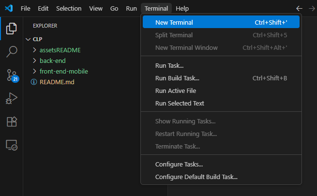

## O que é o CLP?

O **CLP** (Controle de Leitura Pessoal) é uma aplicação que facilita a gestão das suas leituras e ajuda a acompanhar o seu progresso de forma organizada. Com o CLP, você pode:

- **Adicionar seus livros à sua biblioteca pessoal**: Mantenha uma lista dos livros que você está lendo ou planeja ler.
- **Monitorar seu progresso de leitura de maneira simples e eficiente**: Registre as páginas que já leu e veja o quanto falta para concluir cada livro.
- **Estabelecer metas de leitura personalizadas**: Defina prazos para finalizar suas leituras e acompanhe seu desempenho.
- **Compartilhar e descobrir opiniões sobre livros**: Ao concluir uma leitura, você pode avaliar e fazer um comentário sobre o livro, criando uma publicação em uma "rede social" do CLP. Outros leitores também podem fazer o mesmo, permitindo que você veja o que as pessoas acharam dos livros e inspire-se em novas leituras.

O CLP foi desenvolvido para tornar sua experiência de leitura mais organizada e motivadora, ajudando você a alcançar suas metas e explorar novas leituras.

## Por que estou desenvolvendo o CLP?

O desenvolvimento do CLP vai muito além de ser apenas uma ferramenta para gerenciar leituras; ele representa uma forma de consolidar e aplicar todos os conhecimentos que venho adquirindo ao longo do meu percurso no desenvolvimento de software. Desde o início, o CLP foi pensado como um projeto que me permitisse explorar e praticar várias tecnologias e abordagens que estudei, proporcionando desafios reais em diversas áreas, como:

- **Front-end**: Inicialmente, explorei o React para uma versão web do CLP, o que me permitiu aplicar o conhecimento em componentes reutilizáveis, otimização de performance e navegação. Embora essa versão esteja temporariamente desativada, a experiência serviu como base para o desenvolvimento do aplicativo mobile com **React Native**, onde pude colocar em prática todo meu conhecimento na construção de interfaces que oferecessem uma experiência fluida e intuitiva para os usuários.

- **Back-end**: No início do CLP, eu utilizava uma API básica baseada nos meus conhecimentos iniciais e um banco de dados fake para simular o armazenamento de dados. Com o passar do tempo e com a ajuda de cursos focados em Node.js e Mongoose, comecei a aprofundar meu entendimento em back-end. Isso me permitiu evoluir para uma API mais otimizada e implementar um banco de dados real, trazendo maior robustez ao projeto. Ainda que a estrutura do back-end atual não seja algo excepcional, ele representa o marco inicial da minha jornada no desenvolvimento back-end, consolidando meu aprendizado e me motivando a continuar evoluindo nesta área.

O CLP é, portanto, um projeto que reflete minha jornada como desenvolvedor, combinando teoria e prática em um produto que não só resolve um problema pessoal, mas também desafia minhas habilidades em diversas frentes. Cada nova funcionalidade implementada representa um passo importante no aprimoramento das minhas competências técnicas, e minha intenção é continuar expandindo o CLP, sempre buscando novas formas de tornar o aplicativo mais eficiente e inovador, enquanto aplico as melhores práticas de desenvolvimento e acompanho as tendências tecnológicas do mercado.

## Implementações Futuras

Este projeto continua em desenvolvimento e meu objetivo é expandir suas funcionalidades para torná-lo ainda mais completo e inovador. As próximas etapas do roadmap incluem:

* **Versão Web do CLP:** A intenção é reintroduzir uma versão web do aplicativo, utilizando o conhecimento de **React** para oferecer uma experiência consistente em diferentes plataformas.

* **Indicações de Livros Inteligentes:** Com base no que aprendi na cadeira de Inteligência Artificial, pretendo implementar um sistema de recomendação de livros. A ideia é usar técnicas de **machine learning** para analisar o histórico e o estilo de leitura do usuário, oferecendo sugestões personalizadas e relevantes.

* **Comentários:** Será desenvolvida a funcionalidade de comentar em posts, permitindo que os usuários interajam diretamente com as publicações uns dos outros.

* **Atualizações em Tempo Real:** Para que a página de posts se mantenha atualizada sem a necessidade de o usuário recarregar a tela, implementaremos uma ferramenta de mensageria como o NATS.

* **Camadas de Segurança Avançadas:** Para tornar o CLP mais robusto, aplicarei conceitos que aprendi na cadeira de segurança da informação. O objetivo é aprimorar a segurança do back-end com **autenticação** e **autorização** mais robustas, garantindo a proteção dos dados dos usuários.

## Passo a passo para rodar o projeto

### 1. Preparando o Ambiente

**1.1** - Caso não tenha o [node](https://nodejs.org) instalado na maquina, baixe a versão mais recente.

**1.2** - Recomendo utilizar o [Visual Studio Code](https://code.visualstudio.com) como IDE. 

**1.3** - Para instalar a versão do expo que utilizamos, abra o Prompt de Comando(cmd) e rode o comando "npm install -g expo-cli@6.3.12".

**1.4** - No seu celular, acesse a loja (Apple Store ou Play Store) e instale o aplicativo **expo-go** para visualização do projeto.

**1.5** - Antes de inicializarmos, abra o powershell como administrador na sua maquina e rode o comando "ExecutionPolicy" para verificar se já setado como "RemoteSigned".

**Caso não, execute o comando "Set-ExecutionPolicy RemoteSigned".**

**1.6** - É necessário que tanto a máquina que está rodando as aplicações como o seu celular esteja na mesma rede Wifi.

**1.7** - Clone ou baixe o repositório do projeto na sua máquina. 

### 2. Preparando o Front-end

**2.1** - Na pasta do projeto, entre em **front-end-mobile** em seguinda na pasta **api**, dentro haverá um arquivo **api.ts**. Copie o IP da sua máquina, caso não saiba, basta abrir o Prompt de comando (CMD) e executar o comando **ipconfig**, o valor retornado no **Endereço IPv4** corresponde ao parâmetro que queremos. Então troque no código a parte `<seu_EndereçoIPv4_aqui>` pelo valor encontrado e ficará algo como a imagem abaixo. Salve o arquivo e já estaremos integrados com a API. 

**Seu IPV4 pode alterar de acordo com o tempo, sempre que for rodar o projeto, verifique se o mesmo está atualizado**.

### 3. Integrando com API do google

**3.1** - Acesse o [Console do Google Cloud](https://console.cloud.google.com) e faça login.

**3.2** - No topo da página, ao lado do logo do Google Cloud, clique no nome do projeto atual e depois em "Novo projeto". Dê um nome para o seu projeto e crie-o.

**3.3** - Selecione o projeto recém-criado e navegue para **Api e Serviços**.

**3.4** - Busque por **Custom Search API** e selecione-a. Clique em "Ativar" para habilitar a API no seu projeto.

**3.5** - No menu de navegação à esquerda, procure por "Credenciais". Clique em "+ Criar credenciais" no topo e selecione "Chave de API". Confirme e uma nova **chave de  Api** vai ser gerada. Copie-a e salve-a em um lugar seguro.

**3.6** - Acesse o [Painel de Controle da Pesquisa Personalizada](https://programmablesearchengine.google.com/controlpanel/all) do Google. Clique em **Adicionar** ou em **Crie seu primeiro mecanismo de pesquisa**.

**3.7** - Nomeie o seu mecanismo, em **O que pesquisar?** selecione em **Pesquisar em toda web**.

**3.8** - Em **configuração de pesquisa**, ative a opção **Pesquisa de imagens** , preencha o craptcha e clique em criar. 

**3.9** - Quando criado, clique no botão de **Personalizar**. Você verá um campo **ID do mecanismo de pesquisa**, copie a string correspondente.

**3.10** - Agora que temos tanto a **Chave de API** como o **ID do mecanismo de pesquisa**, abra no projeto a pasta do front-end-mobile, procure pelo arquivo .env na raiz do projeto. Terá algo como:

**GOOGLE_API_KEY=`<sua_chaveApi_aqui>`**  
**ID_MECANISMO_PESQUISA=`<seu_IdDoMecanismo_aqui>`**

**3.11** - Altere tanto `<sua_chaveApi_aqui>` como `<seu_IdDoMecanismo_aqui>` por sua **Chave de API** e **ID do mecanismo de pesquisa** respectivamente. Salve o arquivo, e pronto, o projeto está integrado com a API do google.

### 4. Conectando com o banco de dados

**4.1** - Crie uma conta no [MongoDB Atlas](https://www.mongodb.com/cloud/atlas/register) caso ainda não tenha.

**4.2** - Após logar com sua conta, crie um novo projeto chamado **CLP**.

**4.3** - Clique em create a Cluster, selecione a **opção gratuita**, mantenha o nome como **Cluster0** e confirme.

**4.4** - Abrirá uma tela como na imagem acima, salve em um lugar seguro tanto seu **username** como sua **password**. 

**4.5** - Clique em **Create Database User**, em seguida abra a pasta **back-end** no seu projeto, e raiz dela haverá um arquivo .env, nele terá algo como:

**USERNAME_STRING=`<seu_username_aqui>`**  
**PASSWORD_STRING=`<sua_password_aqui>`** 

Troque tanto `<username>` como `<password>` pelos seus dados, atenção para manter o **:** entre os dois. Deverá ficar algo como a imagem abaixo. Salve o arquivo, e pronto você está conectado com o banco.

### 5. Rodando o projeto

**5.1** - Com a pasta do projeto aberta no vscode, abra um terminal.

**5.2** - Em seguida, entre na pasta do back-end, utilizando o comando **"cd back-end"** e rode o comando **"npm install"** para instalar as dependências.

**5.3** - Com as dependências instaladas, alimente o banco de dados com o comando **"npm run seed"**.

**5.4** - Agoora rode o back-end com o comando **"npm start"**.

**5.5** - Sem fechar este terminal, abra outro, em seguida entre na pasta do front-end com o comando **"cd front-end-mobile"** e rode o comando **"npm install"** para instalar as dependências.

**5.6** - Com as dependências instaladas, rode o back-end com o comando **npx expo start**

**5.7** - Ele gerará um qrcode, caso no aplicativo expo go não tenha a opção "Scan QR code" utilize a câmera do seu celular e aponte para o código. Pronto, você já pode desfrutar do CLP.   
